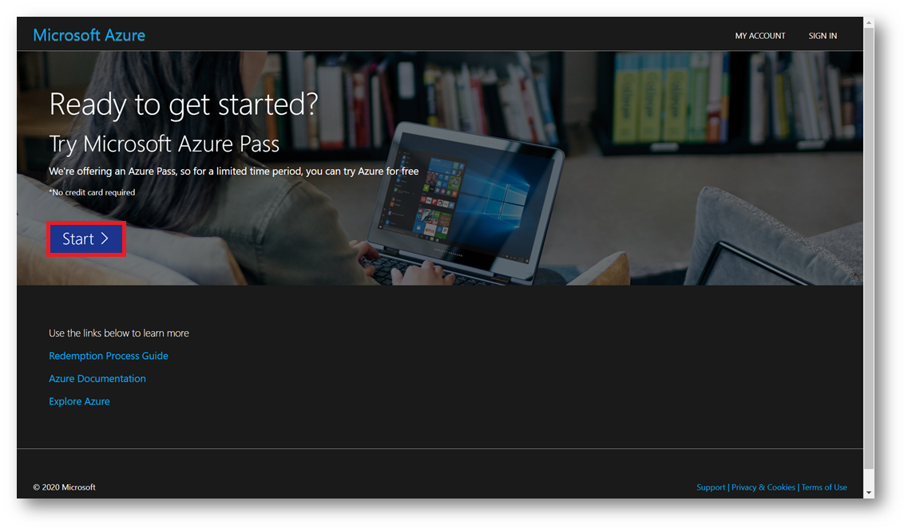
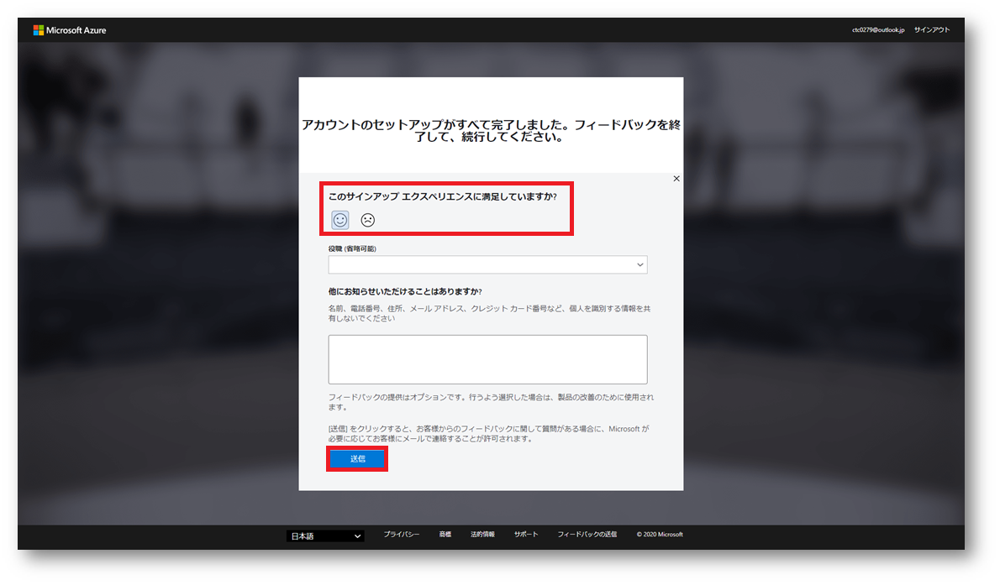

---
lab:
    title: '00 - 事前準備'
    module: 'モジュール 00 - はじめに'

---

# Azure Passをアクティベートする

## 予想時間: 10 分

#### タスク 1：サブスクリプションのアクティベート

このタスクでは、前のタスクで確認したMicrosoftアカウントに、サブスクリプションを関連付けします。

1. [https://www.microsoftazurepass.com](https://www.microsoftazurepass.com ) にアクセスしてください。

1. 「**Start**」をクリックし、演習アカウント(`admin@XXXXXXXXXXX.onmicrosoft.com`)でサインインします。

    

    ------

    **【要注意】**

    「**Microsoft Email: `admin@XXXXXXXXXXX.onmicrosoft.com`**」が必ず今回の研修で使用するアカウント名に表示されていることを必ず確認してください。

    間違ったアカウントで手順を進めると、 誤ったアカウントに Azure Pass が割り当てられ、演習が使用できません。 

    アカウントが違う場合は画面右上のサインアウトを行い、正しいアカウントで認証してください。

    

    ------

    

1. [Confirm Microsoft Account]を押して、promo code を入力し、[Claim Promo Code]を押してください。

    > **注**:(Promo code は講師よりチャットまたは PDF で提供されます。)

    

1. 入力後、画面が遷移するまで、そのままお待ちください。

1. 画面が切り替わりましたら、以下の項目を入力してください。 入力が完了しましたら、[次へ]を押してください。

    

1. 「**サブスクリプション契約、オファーの詳細、プライバシーに関する声明に同意します。**」 にチェックを入れ、「**サインアップ**」を押してください。

    

1. 画面が切り替わりましたら、「**このサインアップエクスペリエンスに満足していますか？**」 を評価し、送信を押してください。

    しばらくすると画面が Azure Portal に切り替わります。

    

1. Azure Portal の画面に切り替わりましたら、準備完了です。必要に応じて、[ツアーの開始]か[後で行う]を選択してください。

    > **注**:もう一度、ツアーを見る場合は画面右上の[？]アイコンを押して、[ガイド ツアーの起動] を選択してください。）
    
    
    
    

#### 参考

ラボに関する情報および注意点です。

- 今後、再度Azure Portalへアクセスする場合、以下のURLからサインインできます。

  アクティベートしたアカウント「**`admin@XXXXXXXXXXX.onmicrosoft.com`**」を使い、サインインを行ってください。

  > **Azure Portal** https://portal.azure.com/

- ラボ環境はアクティベート後から**30日間または$50**に達するまで利用できます。

  残りの日数と残金についてはAzure Portalから確認できます。

  > Azure Portal > サブスクリプション > Azure Pass >  課金情報については... > Check Your Balance

- Azure上でデプロイ(作成)できるリソースは以下となります。

  -Microsoftが提供するサービス(Windows OS、Azure標準のサービス)

  -Open Source Software(OSS)のOSやサービス(Ubuntu、CentOS)

- サードパーティ製のOSやサービスをデプロイすると、**残り日数および残金に問わず**、サブスクリプションが**停止**します。

  デプロイを行わないように注意してください。

   -Red Hat Enterprise Linux (RHEL)やOracle LinuxなどのOS

   -Marketplace上にある課金が発生する仮想アプライアンスなど

  > サードパーティ製品を利用すると、サードパーティの提供する企業へ課金が発生します。
  >
  > この演習環境では利用者(受講者)のクレジットカードを登録していないため、支払いがMicrosoft社になります。
  >
  > Microsoft社は不要な課金が発生しないようにサブスクリプションを停止します。
